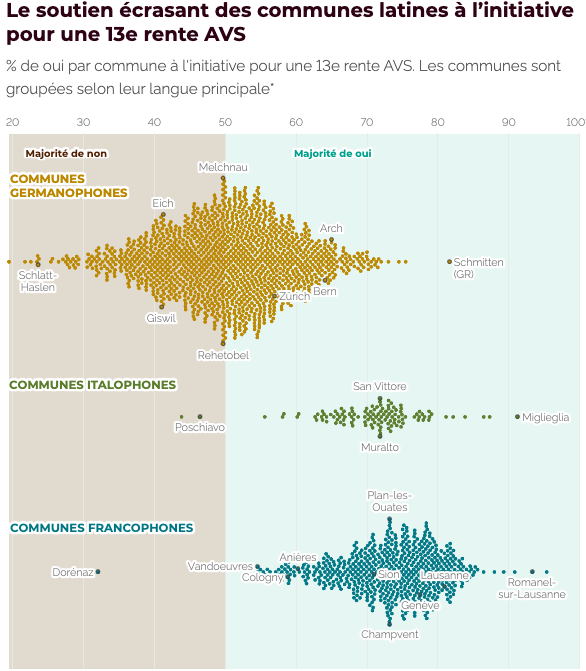

# Datawrapper beeswarm from R

An short example to "hack" [datawrapper](https://www.datawrapper.de) to make a beeswarm in from R that was published in this [Le Temps article](https://www.letemps.ch/suisse/13e-rente-avs-retraite-a-66-ans-les-enjeux-et-les-resultats-des-votations-federales-et-cantonales?utm_medium=partage-social&utm_source=copylink#post-f3e56dae-dc73-4e76-89cb-cd486db97d57).

